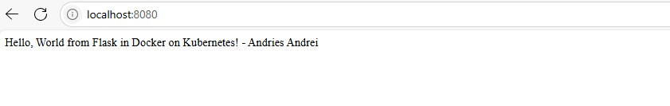

# Docker + Kubernetes - Homework App

This project is a proof of concept flask web app with Docker and Kubernetes manifests.  
These instructions assume **Windows PowerShell** and **minikube with the Docker driver**.

## What you’ll do
1. Start **minikube** (Docker driver).
2. **Build the image *inside* minikube’s Docker** (no admin, no registry).
3. Deploy the Kubernetes manifests.
4. Port-forward the Service and test the app.

---

## First steps

### Create and activate a virtual environment (optional, for local development)
```powershell
python -m venv venv
venv\Scripts\activate.bat
```
 
2. Install dependencies
```powershell
pip install -r requirements.txt
```
 
3. Run locally (without Docker)
```powershell
uvicorn main:app --reload --host 127.0.0.1 --port 8000
``` 
Access: http://localhost:8000 and http://localhost:8000/health

### Minikube + kubectl

- **minikube** is installed and on your PATH (portable install works).
- **Docker Desktop** is installed and **running** (required by the Docker driver).
- `kubectl` is available (or use `minikube kubectl -- ...` as shown below).

Verify minikube is up:
```powershell
minikube start --driver=docker
minikube status
```
You should see `host: Running`, `kubelet: Running`, `apiserver: Running`, `kubeconfig: Configured`.


---

## 1) Build the image *inside* minikube’s Docker
This avoids Windows-specific issues with `minikube image load` and doesn’t require admin rights.

```powershell
# Point your shell to the Docker daemon inside the minikube node
minikube docker-env --shell powershell | Invoke-Expression

# Go to the project root (folder that contains app.py, Dockerfile, k8s/)
cd <path>\homework

# Build the image directly into the cluster node
docker build -t homework-k8s-docker:1.0 .

# (Optional) Verify the image exists inside the node
minikube ssh -- docker images | findstr homework-k8s-docker
```

> Keep your Deployment referencing the same image/tag:
> `k8s/deployment.yaml` → `image: homework-k8s-docker:1.0`

When you’re done working inside the node’s Docker, you can restore your host Docker with:
```powershell
minikube docker-env --shell powershell -u | Invoke-Expression
```

---

## 2) Deploy to Kubernetes
Apply the manifests (make sure your Deployment’s labels and selector match — this repo’s YAML already does):
```powershell
kubectl apply -f k8s/
kubectl rollout status deployment/docker-homework
kubectl get pods -l app=docker-homework
```

**Service access (port-forward):**
```powershell
kubectl port-forward svc/docker-homework 8080:80
```
In another PowerShell (or browser):
```powershell
curl http://localhost:8080/
```

---

## 3) Run locally with Docker
You can also run the container on your host to confirm it works:
```powershell
cd <path>\hello-k8s-docker
docker build -t homework-k8s-docker:1.0 .
docker run --rm -p 5000:5000 homework-k8s-docker:1.0
# New PowerShell:
curl http://localhost:5000/
```

---

## 4) Health checks
The app exposes a health endpoint at `/health`. The Deployment defines **readiness** and **liveness** probes:
```yaml
readinessProbe:
  httpGet:
    path: /health
    port: 5000
livenessProbe:
  httpGet:
    path: /health
    port: 5000
```
If you change the path in `app.py`, update the probes accordingly.

---

## 5) Troubleshooting
- **ImagePullBackOff**: Ensure the image name/tag in your Deployment exactly matches what you built
  (`homework-k8s-docker:1.0`) and that you built **inside** minikube’s Docker (Step 1).
- **Selector/labels error**: In `apps/v1` Deployments, `.spec.selector.matchLabels` must match
  `.spec.template.metadata.labels`. The provided YAML does this for `app: docker-homework`.
- **Port-forward hangs**: Make sure pods are `READY` and `kubectl get pods -l app=docker-homework` shows
  at least one pod `1/1` ready.

---

## 6) Cleanup
```powershell
kubectl delete -f k8s/
# Stop or delete the minikube cluster if you no longer need it
minikube stop
# or
minikube delete
```

---

## Files
- `app.py` — Flask hello world with `/` and `/healthz`
- `Dockerfile` — builds a small Python 3.11 image
- `k8s/deployment.yaml` — Deployment (3 replicas) with readiness/liveness probes; image `homework-k8s-docker:1.0`
- `k8s/service.yaml` — ClusterIP Service `docker-homework` on port 80 → container `5000`

## Final results

Below is a screenshot of the deployed app:

